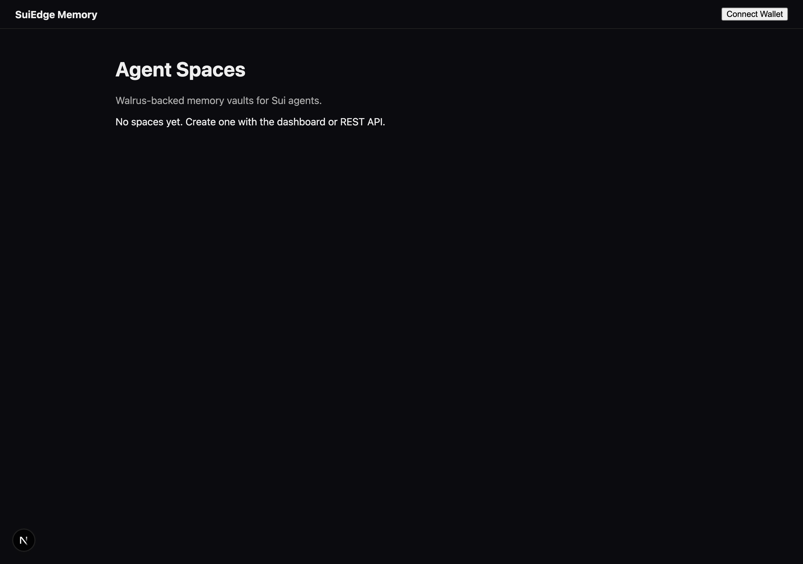
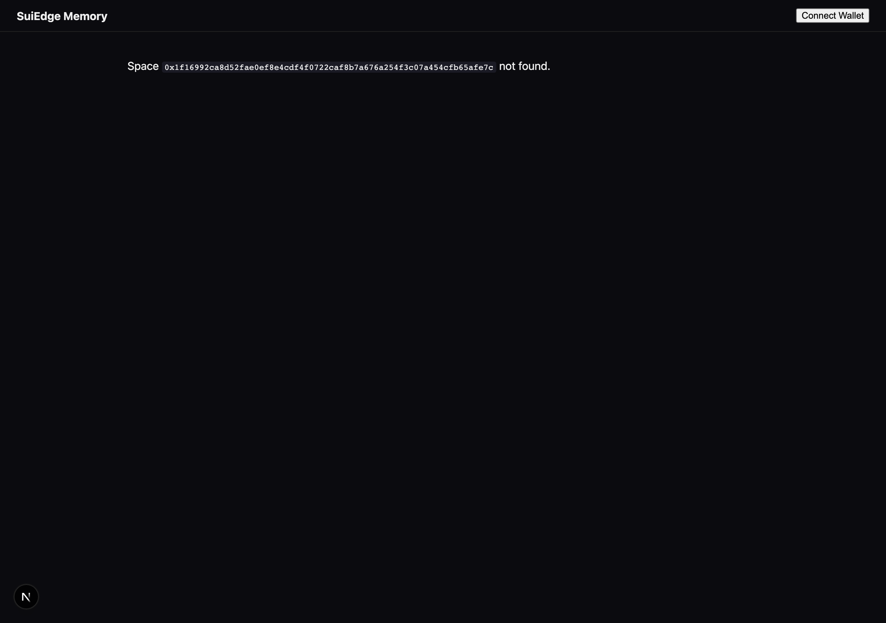

# SuiEdge Memory Gateway

Wallet-owned memory and artifact gateway for AI agents, powered by Walrus and anchored by Sui objects.

## Positioning

SuiEdge Memory Gateway is not a replacement for Walrus or MemWal. Walrus/MemWal are the durable data and memory backends. SuiEdge is the control plane and gateway that makes agent memory usable across tools:

- Sui objects anchor ownership, access policy, active version, and revocation.
- Walrus stores memory, artifacts, and execution logs.
- The gateway exposes REST and MCP interfaces so agent frameworks can read/write memory without knowing Walrus/Sui internals.
- The dashboard lets users inspect memory timelines, artifacts, proof logs, and sharing policy.

## Hackathon track

Primary track: Walrus.

Secondary narrative: Agentic Web.

Why Walrus: the product demonstrates persistent, portable, verifiable memory and artifacts for long-running AI agents.

## MVP flow

1. User connects a Sui wallet and creates an `AgentSpace`.
2. Gateway writes a memory or artifact to Walrus.
3. Sui Move object stores the active Walrus blob pointer, version, owner, and access policy.
4. Agent restores context through `GET /v1/spaces/:id/context`.
5. Another authorized agent can continue from the same context.
6. User revokes access; further reads/writes fail.

## Core concepts

- `AgentSpace`: wallet-owned workspace for one project or agent team.
- `MemoryPointer`: versioned pointer to Walrus-stored memory.
- `ArtifactPointer`: versioned pointer to Walrus-stored files or generated outputs.
- `ProofLog`: execution trace hash and Walrus blob pointer.
- `AccessPolicy`: read/write/share/revoke rules enforced by the gateway and anchored by Sui.

## Interfaces

REST:

```http
POST /v1/spaces
POST /v1/spaces/:id/memories
GET  /v1/spaces/:id/context
POST /v1/spaces/:id/artifacts
POST /v1/spaces/:id/proof-logs
POST /v1/spaces/:id/revoke
```

MCP tools:

```text
memory.write
memory.search
context.load
artifact.save
trace.log
policy.share
policy.revoke
```

## Six-day build plan

- Day 1: Sui Move package skeleton, Next.js app, wallet connect, API shape.
- Day 2: Walrus write/read integration, `AgentSpace` create flow.
- Day 3: Memory timeline, active context restore, version pointers.
- Day 4: Access policy, share/revoke, multi-agent demo.
- Day 5: ProofLog, artifact upload, dashboard polish.
- Day 6: deploy, README, submission text, five-minute demo video.

## Quick links

- **GitHub**: https://github.com/DaviRain-Su/suiedge-memory-gateway
- **One-click deploy**: https://railway.com/new/template?template=https%3A%2F%2Fgithub.com%2FDaviRain-Su%2Fsuiedge-memory-gateway
- **Deploy guide**: [DEPLOY.md](./DEPLOY.md)
- **Demo video script**: [docs/STORYBOARD.md](./docs/STORYBOARD.md), [docs/RECORDING.md](./docs/RECORDING.md)
- **Submission text**: [docs/SUBMISSION.md](./docs/SUBMISSION.md)

## Run locally

```bash
pnpm install
sui move test                    # 7 Move tests
pnpm exec tsc --noEmit           # typecheck
pnpm test                        # 36 vitest tests
pnpm dev                         # Next.js dev server on http://localhost:3000
```

## Architecture (one paragraph)

Three layers: agent frameworks (LLM / SDK) call into a Next.js gateway; the gateway calls Sui Move (`agent_space`, `memory_pointer`, `access_policy`) and Walrus (HTTP PUT/GET); an off-chain SQLite index keeps blob-id ↔ object-id mappings for fast reads. The gateway is the only component that knows both Move and Walrus. See [DESIGN.md](./DESIGN.md) for the architecture diagram and [DESIGN.detailed.md](./DESIGN.detailed.md) for file-level implementation specs.

## Demo

```bash
# In one terminal
pnpm dev

# In another terminal
OWNER=0x...your_address REVIEWER=0x...other_address AUTH_STUB=1 bash docs/demo.sh
```

`AUTH_STUB=1` lets the gateway accept the literal signature `stub` so the demo runs without a real wallet signer. For production, replace `src/lib/auth.ts` `requireAuth` with `@mysten/sui`'s `verifyPersonalMessage` and a `LiveSuiClient`.

## Run the MCP server

```bash
SUI_OWNER_ADDRESS=0x... pnpm run mcp
```

Connects over stdio. Exposes 9 tools (`space.create`, `space.list`, `memory.write`, `memory.search`, `context.load`, `artifact.save`, `trace.log`, `policy.share`, `policy.revoke`).

## Go live (testnet)

```bash
# 1) Get testnet SUI for your address
sui client new-address ed25519 testnet
sui client switch --address <alias>
sui client faucet                                       # testnet SUI

# 2) Publish the Move package and capture the package id
pnpm run publish:testnet
set -a && . .env.testnet && set +a

# 3) Run the dev server in live mode
SUI_CLIENT_LIVE=1 pnpm dev
```
What changes in live mode:

- `LiveSuiClient` is wired (instead of `MockSuiClient`) and submits real PTBs via `SuiGrpcClient` for testnet, signed by `EnvKeypairSigner` loaded from `SUI_PRIVATE_KEY`.
- `HttpWalrusPublisher` writes to the public Walrus testnet publisher and reads from the public aggregator. The default URLs are already in `src/lib/config.ts`.
- `requireAuth` calls `verifyPersonalMessageSignature` for every request — `AUTH_STUB_PASS=1` skips this for offline demos.
- The deployer's keypair owns the `AgentSpace`. In a real product the user would sign in their own wallet and the gateway would forward the PTB; the MVP shortcut is documented in `DESIGN.detailed.md` §14.

### Live verification (already run during build)

```text
published Move package id: 0xf4bf00ae02a356233837c7f96820b5ba0c3f646af7d4eb495589996febf50d53
Walrus testnet round-trip: PUT blob → blobId u_pRa6Ur-kUbguw6nJMmncIy47e8BpKC-gi51MinjhE → GET bytes match
Sui testnet createSpace PTB:  digest 93Z6uizbPrKwE7z82iwRjUULAcB9WXJTQ7YEWwpoQ99n
scripts/demo.sh against live server:        7/7 steps pass in ~30s
tests/gateway/live/testnet.test.ts:         2/2 pass
tests/gateway/e2e/mvp.test.ts:              1/1 pass
pnpm test (offline suite):                  36/36 pass
sui move test:                              7/7 pass
pnpm exec tsc --noEmit:                     clean
```

Dashboard screenshots from a live run (captured by `scripts/screenshot.mjs`):



[Chinese version](./README.zh.md)
